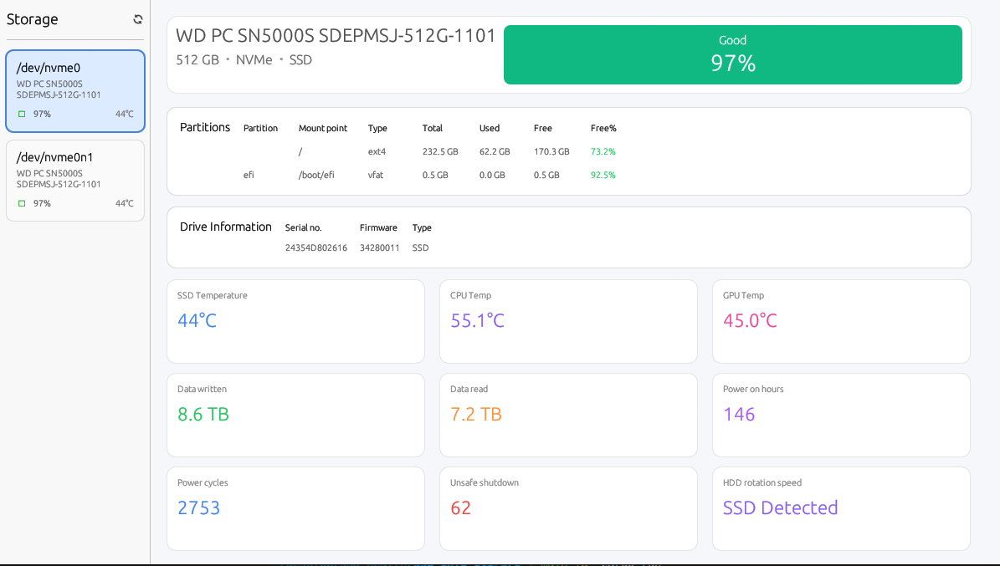

# SSD Health Checker

A modern GUI application for monitoring SSD and HDD health using SMART data. Built with Rust and egui for a fast, native experience.

## Screenshots



## Prerequisites

### Required System Packages

**Ubuntu/Debian:**
```bash
sudo apt-get update
sudo apt-get install smartmontools lm-sensors
```

**Fedora/RHEL/CentOS:**
```bash
sudo dnf install smartmontools lm-sensors
```

**Arch Linux:**
```bash
sudo pacman -S smartmontools lm-sensors
```

**openSUSE:**
```bash
sudo zypper install smartmontools sensors
```

For GPU temperature monitoring

**NVIDIA GPU:**
```bash
sudo apt-get install nvidia-utils
```

### Rust Toolchain

You need Rust 1.75 or newer:
```bash
curl --proto '=https' --tlsv1.2 -sSf https://sh.rustup.rs | sh
```

## Installation

### From Source

1. Clone the repository:
```bash
git clone https://github.com/yourusername/ssd_info_cli.git
cd ssd_info_cli
```

2. Build the application:
```bash
cargo build --release
```

3. Run the application:
```bash
sudo ./target/release/ssd_info_cli
```

## Troubleshooting

### No drives detected

1. Ensure you're running with sudo:
   ```bash
   sudo ssd_info_cli
   ```

2. Verify smartctl is installed:
   ```bash
   which smartctl
   ```

3. Check if smartctl can detect your drives:
   ```bash
   sudo smartctl --scan
   ```

### Temperature not showing

**CPU Temperature:**
- Install lm-sensors: `sudo apt-get install lm-sensors`
- Run sensor detection: `sudo sensors-detect` (answer YES to all)
- Test: `sensors`

**GPU Temperature:**
- For NVIDIA: Install nvidia-utils
- For AMD: Temperature detection may vary by GPU model

### Permission errors

The application needs root access to read SMART data. Always run with `sudo`.

## Building from Source

### Dependencies

The following Rust crates are used:
- `eframe` - GUI framework
- `egui` - Immediate mode GUI
- `regex` - Pattern matching for parsing smartctl output
- `sysinfo` - System information and partition data
- `image` - Image loading support
- `nix` - Unix system calls

### Development

```bash
# Run in debug mode
sudo cargo run

# Run with logging
sudo RUST_LOG=debug cargo run

# Build release version
cargo build --release

# Run tests
cargo test
```

## Configuration

The application auto-detects drives in `/dev/` and automatically refreshes every 5 seconds. No configuration file is needed.

## License

This project is licensed under the GNU General Public License v3.0 - see the LICENSE file for details.